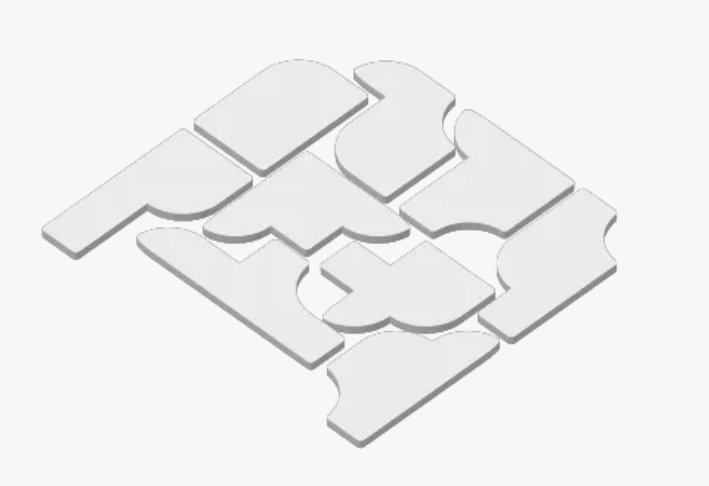

# TilePuzzle
I ran across this 3d printed puzzle the other day and was having trouble solving it. 
I thought I could build a little program to help me solve it.

However, like most other things one thinks they can knock out in an hour or so, this took many hours.

And it turns out that there is a 'trick' to this puzzle which basically makes it unsolvable with the approach I was taking.

I decided to put a little twist on it and make it solvable by adjusting a piece so that it is solvable with a 90 degree grid method. However, it now finds 48 solutions with this change. 

This code actually does find a solution to a tiling puzzle where you have tiles that you can rotate and flit and put into a grid. 

On my older i9 PC from 2019, it takes about 10 seconds to find a solution for a 9x6 grid with 9 pieces.

I thought that the process for solving was interesting and the fact the the corners are partially rounded and convex and convave make things even trickier.

## The Process
1. Create an array for each piece
1. Create all the flip and rotate permutations. Remove duplicates.
1. Place the first piece in the 0,0 location in the grid
1. Make sure that there are only regions that have 6 or more contiguous spaces. If not this doesn't work.
1. Find the next open spot and place the next piece there that fits. 
1. Recursively do this until all the pieces are placed. 

One of the keys to speed was checking if there was an enclosed space that wasn't at least squares in size. If so, the program backtracks and tries a different piece in the location iteratively finding the solution.

Additionally, this puzzle was challenging because it had the partial aspects of the pieces. Some pieces were concave and some were convex. The general approach for the array values was as follows.
1. Empty Square: 0
2. Full square: 1
3. Convex partial: +45, +135, +225, +315. This way I knew which concave pieces would fit.
4. Concave partial: -45, -135, -225, -315. If these would combine the additive value would be either 180 or -180.
5. If it was combined: -180 or 180. This does lose some data and would have been nice to display. But the two extra needed unicode characters don't exist anyway.
6. The logic to check for filled squares is now >0 or != -180. 

I did try making the numbers for the angled pieces exact opposites, which causes them to add to zero, but that added extra code and other arbitrary numbers for the two parts coming together so I left it.

Also, while I was tracking the approximate (no x and y offsets) locations of the pieces, it would have been cool to show the pieces in the output in color so each piece was obvious on the printouts. 

BTW: I just wanted to get this done, so there are probably lots of little issues here that need to get cleaned up. Please don't take this as pristine code.

BTW2: There is a solution image in the repo in case you want to know what it should look like.
